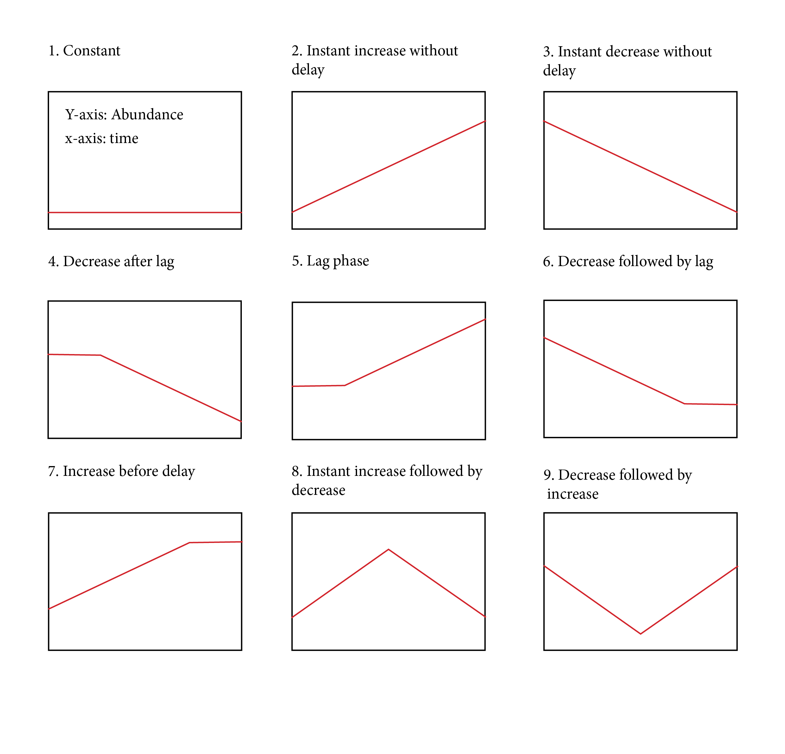

# Population development scenarios

[Rob Hyndman](https://robjhyndman.com/) developed an R function to estimate the existence and length of the time lag in species populations based on species occurrence time series. The [method published in Biological Invasions](https://link.springer.com/article/10.1007/s10530-015-0962-8) detects a period of stagnant population growth prior to an increase. While the original script distinguishes species with a biphasic population growth, this update fits a piecewise model to differentiate between multiple [scenarios.](https://github.com/PhillRob/lag-scenarios/blob/master/lag-scenarios.pdf)
The script fits a maximum of 5 linear splines and determines the slope. The number of splines depends on the best model (highest AIC). Lag phases are reported if one or more splines have a slope of 0. 

## Installation
You can install the Population Growth package from github with:
  
``` r
# install.packages("devtools")
devtools::install_github("PhillRob/PopulationGrowthR")
library(PopulationGrowthR)
```

## Data
Raw GBIF data is included as test data is included along with formatted input data. 
```r
load("data/rawdata.rda")
load("data/fdata.rda")
load("data/yeardata.rda")
```

## Fiting the model
This is a basic example that fits the model to the test data. 
  
``` r
lagTest <- lagfit(data = fdata, yeardata = yeardata)
```
## Plotting the results
```r
freqPlot <- freqplot()
plot <- plot ()
```

## GBIF wrangler
You can use `raw2freqdata.R` to wrap [GBIF](https://www.gbif.org/) data downloaded using the [rgbif package](https://CRAN.R-project.org/package=rgbif) by @Scott_Chamberlain_Vijay_Barve_Dan_Mcglinn_Damiano_Oldoni_Laurens_Geffert_Karthik_Ram2018-zi into the format required by the lag code. 

``` r
# get gbif occurences
if (!require(rgbif)) install.packages('rgbif')
library(rgbif)

species <- c("Vachellia farnesiana", "Achyranthes aspera"))
gbifkey <- sapply(species, function(x)
  name_backbone(name = x, kingdom = 'plants'),
  USE.NAMES = FALSE)
gbifkey <- as.data.frame(gbifkey)


gbifocc <- occ_search(taxonKey = gbifkey[1,], limit = 200000, country = "US",  return = "data")
gbifocc <- ldply(gbifocc, data.frame)

# format gbif data to format for lag code
lagdata <- raw2freqdata(x = gbifocc)
```

## Method
### Model fit
This function also allows to specify the number of knots (0-4) and returns the scenario of the fit between the knots. A sequence of 0, + or - is returned. A 0 indicates constant, + indicates a positive slope and a - indicates negative slope.
The function fits generalised linear models @Hyndman2015-rt to the Poisson distributed count data and adjusts the collection rate by the overall collection effort.
$$n_t \sim Poisson(N_t  exp[f(t)])$$
$N_t$ = total number of samples of alien species/year

$n_t$ =  number of samples of focal species/year

A lag-phase exists if $f(t)$ is constant until some year, and then increases.

The results return the scenario per species including the slope of every individual splines.
* negative sign (-) reflects a negative slope and a decrease in abundance
* positive sign (+) reflects a positive slope and a increase in abundance
* zero (0) reflects a stagnant growth with a slope of 0

### Scenarios
Attached a few examples of single know scenarios. 

**1. Constant (single-phase, no lag):** No biphasic pattern is detected and the abundance remains constantly low/high. A species is managed or only survives in a nurtured human assisted context. The species (sleeper weed) may still be exploring suitable conditions at the margin of their 'niche', with potential for population expansion. 

**2. Instant increase without delay (single-phase, no lag):** No biphasic population change is detected and the species population growth is continuously positive. The species may be nurtured, continuously introduced (high propagule pressure) or introduced at a location with suitable biotic and abiotic conditions.

**3. Instant decrease without delay (single-phase, no lag):** A decrease can be linked to a successful eradication effort, stopped nurturing or halted introduction of non-naturalized aliens. The species may also rely on biotic interaction (muralists) that are absent in the invaded environment. A change in the survey effort may be linked. 

**4. Decrease after lag (biphasic, lag):** A delayed decrease can occur if a successful establishment is followed by an eradication, halted nurturing efforts or change in biotic or abiotic conditions. A change in the survey effort may be assiciated to this pattern. 

**5. Lag phase:** The original scenario showing rapid increase after delay (biphasic, lag)

**6. Decrease followed by lag (biphasic, lag)**

**7. Increase before delay (biphasic, lag)**

**8. Instant increase followed by decrease (biphasic, no lag)**

**9. Decrease followed by increase (biphasic, no lag)**




# References
